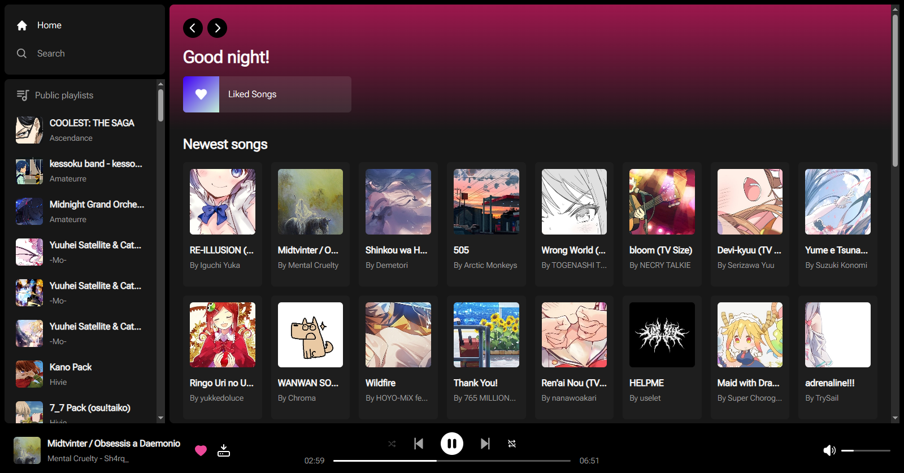

# 🎵 osu!tify

>[!WARNING]
>xoderton's fork is not affiliated with [@richardscull](https://github.com/richardscull/) and mostly likely won't be up-to-date with [original repository](https://github.com/richardscull/osutify/), bringing only unique features to [xoderton](https://github.com/xoderton/), use it at your risk! ^w^

## Description

osu!tify is a project that aims to create a music player specifically designed for the game osu!. The application uses the osu! API to fetch the latest songs and allows users to play them directly from the application. The application also includes a liked playlist where users can add their favorite songs.

## Features

- Up-to-date song library from osu! and mirror servers
- Song playback with progress bar and controls
- Liked playlist with favorite songs

## Installation

### Web App

1. Clone the repository: `git clone --branch feature/tauri https://github.com/xoderton/osutify/`
2. Install the required dependencies: `npm install --force`
3. Start the application: `npm start`

### Standalone App

1. Clone the repository: `git clone --branch feature/tauri https://github.com/xoderton/osutify/`
2. Install the required dependencies: `npm install --force` *(not required, if you already installed Web App)*
3. Start the application: `npm run tauri dev`

- [feature/tauri](https://github.com/xoderton/osutify/tree/feature/tauri/) also requires to install [Rust](https://www.rust-lang.org/) on your computer in order to run it.

## License

This project is licensed under the MIT License. See the [LICENSE](LICENSE) file for more details.
